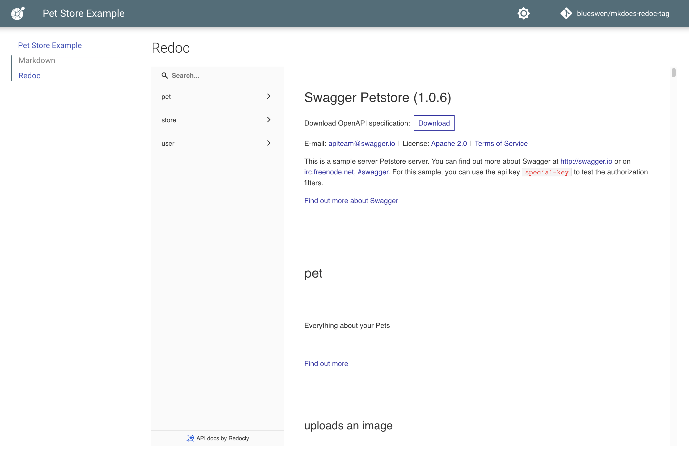

# MkDocs Redoc Tag 

<a target="_blank" href="https://pypi.org/project/mkdocs-redoc-tag"></a>
<a target="_blank" href="https://pypi.org/project/mkdocs-redoc-tag"></a>
<a target="_blank" href="https://codecov.io/gh/blueswen/mkdocs-redoc-tag"></a>

A MkDocs plugin supports adding [Redoc](https://github.com/Redocly/redoc) to the page.

## Features

1. OpenAPI Specification file from online over URL or static file in docs
2. All dependencies are using static files handled by the plugin not from CDN, especially suitable for those documents been deployed in the intranet
3. Synchronized dark mode with [Material for MkDocs](https://squidfunk.github.io/mkdocs-material/)

## Dependency

1. Python Package
    1. beautifulsoup4>=4.11.1
2. Redoc standalone javascript from [official CDN](https://github.com/Redocly/redoc?tab=readme-ov-file#releases)
    1. redoc==2.1.3

## Usage

1. Install the plugin from Pypi

    ```bash
    pip install mkdocs-redoc-tag
    ```

2. Add ```redoc-tag``` plugin into your mkdocs.yml plugins sections:

    ```yaml
    plugins:
       - redoc-tag
    ```
3. Add ```redoc``` tag in markdown to include Redoc:

    ```html
    <redoc src="https://petstore.swagger.io/v2/swagger.json"/>
    ```

    

4. You may customize the plugin by passing options in mkdocs.yml:

    ```yaml
    plugins:
       - redoc-tag:
            background: White
    ```

    | Options | Type | Description |
    |---|---|---|
    | background | String | Default: "". Redoc iframe body background attribute value. You can use any css value for background for example "#74b9ff" or "Gainsboro" or "" for nothing. |
    | height | String | Default: "80vh". Height of Redoc iframe. |

## How it works

1. Copy Redoc script file into `site/assets/javascripts/` directory
2. Search all redoc tags, then convert them to an iframe tag and generate the iframe target html with the given OpenAPI Specification src path

## License

This project is licensed under the MIT License - see the [LICENSE.md](https://github.com/Blueswen/mkdocs-redoc-tag/blob/main/LICENSE) file for details.

## Reference

1. [redark](https://github.com/dilanx/redark): source of dark mode javascript and css
